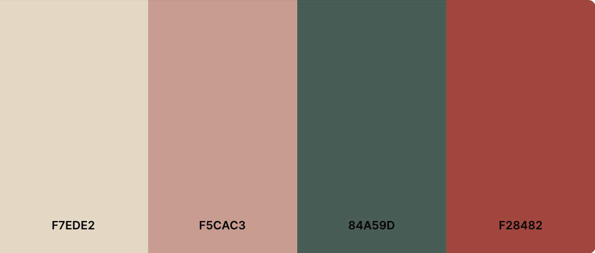

# **Footwear Fusion**


🔗 View the live website here: [Footwear Fusion](https://footwear-fusion-9bb895189ceb.herokuapp.com/)
</br>  

## **Introduction**
Introducing Footwear Fusion, your go-to e-commerce destination for trendy shoes and stylish accessories! The platform offers a wide selection of footwear, complemented by an array of fashion-forward accessories like bags and wallets. Designed with user security in mind, Footwear Fusion incorporates robust authentication and Stripe payment integration, ensuring a secure and seamless shopping experience.

This site, which I developed for the Code Institute's Milestone Project 4, combines style and security. It showcases my skills in full-stack development, blending HTML, CSS, JavaScript, and Django+Python, and includes Stripe for secure payments. Experience a seamless and secure shopping journey with Footwear Fusion!

<br/>  

## **Table of Contents**   
1. [UX Development Planes](#ux-development-plane)   
   A. [Strategy Plane](#a-strategy-plane) 
      - [Project Goals, User Goals, and Site Owner Goals](#project-goals)   
      - [User Stories](#user-stories)   
   B. [Scope Plane](#b-scope-plane)  
   C. [Structure Plane](#c-structure-plane)  
   D. [Skeleton Plane (Wireframes)](#d-skeleton-plane)  
      - [Color Scheme](#color-scheme)  
      - [Typography](#typography)  
2. [Database Design](#database-design)  
3. [Features](#features)   
   A. [General Design Features](#a-general-design-features)   
   B. [Page Features](#b-page-features)  
   C. [Features to be Implemented in The Future](#features-to-be-implemented-in-the-future)
4. [Testing](#testing)    
   - [Go to TESTING.md](TESTING.md)
5. [Issues and Bugs](#issues-and-bugs)
6. [Technology Used](#technology-used)
   - [Main Languanges](#main-languages) 
   - [Libraries and Frameworks](#libraries-and-frameworks)
   - [Database Management](#database-management)  
   - [Tools and Programs](#tools-and-programs) 
7. [Deployment](#deployment)  
   A. [How To Use This Project](#a-how-to-use-this-project)  
   B. [Deployment to Heroku](#b-deployment-to-heroku)   
   C. [AWS Bucket Creation](#c-aws-bucket-creation)  
   D. [Connect Django to AWS Bucket](#d-connect-django-to-aws-bucket)  
8. [Credits](#credits)
   - [Code](#code)
   - [Contents](#contents)
   - [Images](#images)
9. [Acknowledgements](#acknowledgements)

------

## **UX Development Plane**   
### **A. Strategy Plane**  
#### **Project Goals**   
The foremost objective of this project is to establish an e-commerce platform that excels in functionality, boasts an aesthetically pleasing design, and offers an intuitive user experience, even for first-time visitors. The site will provide essential e-commerce capabilities, including user registration and login, item selection, and secure payment processing. Beyond these fundamental features, the website aims to enhance user engagement and interaction. This will be achieved through additional functionalities, such as the ability to add products to a wishlist, submit product reviews, and access informative articles. The overarching goal is to ensure a seamless, enjoyable, and enriching shopping experience for all users.

#### **User Goals**  
Users seek a platform that offers:
- A user-friendly and intuitive online store/website, ensuring effortless navigation and a seamless purchasing experience.
- A digital storefront that not only facilitates shopping but also offers additional interactive activities to enhance user engagement.

The intended audience for this website includes:

Individuals aged 18 to 40, primarily young adults.
Trendy and style-conscious individuals.
Those who appreciate the ease of technology and are active on social media platforms.

#### **Site Owner Goals**  
The primary objectives of the site owner include:
- Generating revenue through the sale of products (and services) to customers.
- Efficiently administering the range of products offered on the website.

#### **User Stories** 
- As a shopper I want to be able to:
  1. Rapidly discern the type of products or services offered by the site.
  2. Instantly notice any special deals or promotions.
  3. Effortlessly search for specific products.
  4. Observe a preview of the most popular products.
  5. Browse through all products and smoothly transition between different categories.
  6. Organize products by price, rating, or popularity.
  7. Explore detailed information on individual product pages.
  8. Access reviews for products.
  9. Conveniently choose product size and quantity, and add them to the shopping bag.
  10. View the contents of the shopping bag.
  11. Modify the shopping bag by changing product quantities or removing items.
  12. Seamlessly proceed to checkout and input payment details.
  13. Be assured of the security of personal and payment information.
  14. Receive confirmation of orders post-purchase.
  15. Get email notifications confirming purchases.
  16. Engage with informative articles or blogs about shoes and accessories.
  17. Navigate the site with ease using the Navigation Bar and Footer.
  18. Register for an account without hassle.
  19. Locate a FAQ section for inquiries.
  20. Contact the store through an accessible contact form.

- As a registered user/ shopper, I want to be able to:
  1. Access all functionalities available to non-registered shoppers.
  2. Log in and log out with ease.
  3. Promptly recover forgotten passwords.
  4. Get email confirmations upon registration.
  5. Manage a personal user profile to view order history and update personal details.
  6. Submit reviews for previously purchased products.
  7. Modify or delete personal reviews.
  8. Place products in a wishlist for convenient access to items I'm interested in buying.
  9. Remove products from the wishlist, so I can remove products I don't wish to purchase.
  10. Transfer products from the wishlist to the shopping bag effortlessly.

- As an admin and store management, I want to be able to:
  1. Add new products to the inventory.
  2. Modify or update product details.
  3. Remove products from the listing.

[Back to top &uarr;](#table-of-contents)  

<br/>  

### **B. Scope Plane**  
A comprehensive scope has been established for the site, taking into account all objectives and user narratives, while also allowing for potential future enhancements.

#### **Functional Requirements**  
Unregistered users can:
- Register by providing a username, email, and password.
- Browse all products and organize them by price, rating, and color.
- Conduct product searches.
- Access detailed product information.
- Place products into a shopping bag.
- Modify and remove items in the shopping bag.
- Complete purchases and process payments.
- Receive email confirmations for transactions.

Registered users have the capabilities of unregistered users, plus they can:
- Log in with a username and password.
- Access and edit their profile page.
- Update their delivery/contact details on the profile page.
- Review their order history on the profile page.
- Post, edit, and delete reviews for purchased products.
- Add and remove products from their wishlist.
 
Admin/site owners possess all registered user functionalities, as well as the ability to:
- Add new products to the site.
- Edit or update product details.
- Remove products from the site.

#### **Non-functional Requirements**  
Users will have the opportunity to:
- Explore articles and blogs about shoes, accessories, and fashion trends.
- Access a FAQ page for answers to common questions.
- Communicate with the store through a contact form.
- Navigate the site with ease and intuition.

<br/>  

### **C. Structure Plane**  
The website features a Hierarchical Tree Structure, meticulously organized to facilitate easy and intuitive navigation for users. Illustrated below is the website's workflow, thoughtfully crafted using [Creately](https://creately.com/).  

   
The design distinctly differentiates the access levels between unregistered and registered users. While unregistered users have the capability to purchase products and receive confirmation emails, they lack certain privileges exclusive to registered users, including:

- Accessing their order history
- Posting, editing, and deleting product reviews
- Creating a personalized list of favorite products.

All the aforementioned functionalities are accessible only to users with a registered account.

[Back to top &uarr;](#non-functional-requirements)  
<br/>  

### **D. Skeleton Plane**  
Using [Balsamiq](https://balsamiq.com/), wireframes were developed to outline the website's navigation and interface. These wireframes, specifically designed for desktop viewing, form the foundation upon which the interface will be adapted for various device sizes.

👉 [View Footwear Fusion Wireframes here](readme-testing-files/readme/wireframes "The color scheme")
<br/>

#### **Color Scheme**  
The website's design language is articulated through a color palette that captures the essence of tranquility and natural beauty. Each hue is carefully chosen to create an ambiance that is both calming and welcoming, with a subtle infusion of warmth that conjures a sense of peace and serenity.
At the heart of the palette featured on [Coolors](https://coolors.co), is a gentle cream tone (#F7EDE2), emanating a soft and welcoming aura. Complementing this, a delicate blush pink (#F5CAC3) is selectively employed in minor sections for subtle accents, adding a nuanced layer to the overall aesthetic. Alongside, an effervescent coral (#F28482) injects the layout with a lively yet cozy warmth, resonating with a cheerful and dynamic spirit. Grounding these effusive tones, the muted teal (#84A59D) lends an earthy depth to the aesthetic, echoing the brand's connection to natural elements and understated elegance.

The selection of these colors transcends mere visual pleasure; it is a deliberate strategy to elicit a psychological sense of ease and contentment among visitors. This chromatic harmony is woven consistently throughout the website’s interface, from the tactile feedback of interactive elements to the enchanting allure of the hero image. Each detail is steeped in these colors, crafting a cohesive and engaging digital narrative that guides the user through an effortlessly integrated visual experience.


#### **Typography**  
The typographic elements of the website are curated from the extensive collection available at [Google Fonts](https://fonts.google.com).   
- Primary Typeface: Noto Sans
  Serving as the primary typeface, Noto Sans is a sans-serif font favored for its contemporary and sleek aesthetic. It is employed across the board for paragraphs and button labels, offering a crisp and uncluttered look.
- Accent Typeface: DM Serif Display
  For a striking contrast, DM Serif Display is utilized for header texts on the Home page. As a serif font, it provides an elegant counterpoint to the sans-serif body text, adding a touch of sophistication and visual interest.

#### **Design Changes on The Final Product**  
The original wireframes were foundational in shaping the final design, however, adjustments were made to ensure optimal functionality and aesthetics:

- The logo underwent a transformation to a bolder version for enhanced visibility, addressing the issue that the initial, finer logo was not as prominent on smaller screens.
- Additional refinements included alterations in button colors and image selections, which were part of the creative evolution during the development process.

[Back to top &uarr;](#user-goals)  

<br/>

## **Database Design**    

The database structure was conceptualized and outlined using [drawsql](https://drawsql.app/), starting with SQLite for the development phase and transitioning to Postgres for the production environment on Heroku. 
  

- **Category Model**   
   - This model holds the category names for products, such as Women, Men, and Kids.
   - It includes a 'name' field for database identification and a 'friendly_name' field for the user interface display.

- **Subcategory Model**
   - This captures the subcategory names for products, which range from Sandals to New Arrivals.
   - The Category and Subcategory models are designed to be independent; no direct relationship is established to allow for greater flexibility.
   - Similar to the Category model, it has 'name' and 'friendly_name' fields for database and display purposes, respectively.  

- **Product Model**  
   - This model is a repository of comprehensive product details.
   - It is linked to the Category and Subcategory models through foreign keys.
   - Includes fields such as 'sku' for product identification, 'name', 'has_sizes' as a boolean to indicate if size variations exist, 'price', and 'rating'. 
   - The 'rating' initially reflects a retailer-provided quality assessment, which is updated as users review the product.
   - 'image' field for product visuals, and 'total_purchased' to track sales volume.

- **User Model**  
   - Integral to the Django authentication system, this model stores user credentials, including username, email, and password. [django.contrib.auth](https://docs.djangoproject.com/en/4.0/ref/contrib/auth/).

- **Order Model**
   - This model documents all the data related to successful orders.
   - It encompasses numerous fields from 'order_number' to 'stripe_pid', detailing everything from the buyer's information to payment details.

- **OrderLineItem Model**
   - Details of individual product orders are stored here.
   - It includes a 'product_size', 'quantity', and 'lineitem_total', which is the product of quantity and price.

- **UserProfile Model**
   - For registered users, this model holds shipping and contact information.
   - It is linked to the User model and contains fields like 'default_phone_number', 'default_country', etc.

- **Review Model**  
   - Captures user reviews for products they've purchased.
   - Includes a 'rating', 'review_text', and 'date' among other fields.

- **Blog Model**  
   - Used for storing blog articles for the website.
   - Contains fields for 'image', 'author', 'title', 'paragraph1', 'paragraph2', 'paragraph3', and 'created_on'.

- **Favorites Model**  
   - Keeps track of a user's favorite products.
   - To handle the many-to-many relationship with products, an intermediary model called 'FavoritesItem' is used, aligning with best practices from the Django documentation. ([source from django documentation](https://docs.djangoproject.com/en/4.0/ref/models/fields/#django.db.models.ManyToManyField.through_fields)).

- **Topic Model**
  - This model manages topics for the contact form.
  - It has a 'subject' field for database entries and a 'text' field for the display on the contact form.

- **ContactForm Model**
  - Stores submissions from the contact form.
  - Includes 'name', 'email', 'topic' (linked to the Topic model), 'order_number', 'message', and 'date' fields.

Each model is crafted to not only store essential data but also to create a seamless interaction between different segments of the site, ensuring data integrity and user experience are maintained at the highest standard.

<br/>  

## **Features**  
### **A. General Design Features**  
- **Responsive Design:** The website adapts seamlessly to all devices, ensuring a consistent user experience from the smallest smartphone (minimum width 320px) to the largest desktop display. Navigation is made effortless with intuitive buttons, accessible at any point during the user's journey through the site. 

- **Navigation Bar Across All Pages:**

    

   - A distinct favicon, representing the essence of the website, appears at the top of the browser tab, enhancing brand recognition and reinforcing the website's nature.

    

   - The Navbar is designed for flexibility, transforming into a hamburger menu on smaller screens for ease of use, and remains fixed at the top of the screen (sticky) for convenient navigation regardless of the user's position on the page.
   - Symmetrically centered at the top, the logo acts as a beacon, always ready to guide users back to the homepage.
   - The search box is strategically placed on the left within the Navbar to facilitate quick keyword searches from the outset.
   - Sign In/Register buttons are prominently located at the top-right corner for unregistered users, unfolding options for either action. This area transforms into a My Account dropdown upon logging in, offering direct links to the user's profile and log-out function.
   - Quick-access links to Favorites and Shopping Bag are embedded within the Navbar, ensuring they're always within reach, no matter where users find themselves on the site.
   - Navigation links are provided for all product categories and subcategories: All Products, Women, Men, Kids, Accessories, and Sale.
   - A persistent sales banner positioned just below the Navbar alerts users to free delivery options, visible on every page for constant visibility.

- **Footer Accessible on All Pages:** 

    
   The Footer mirrors the Navbar's color scheme for design continuity and houses all navigational links, social media connections (which open in a new tab), and the central logo that circles back to the Home page when clicked. 

- **Toast Notifications:**   
Toast notifications serve as an interactive feedback mechanism for users, confirming the success or alerting to the failure of their actions. These notifications are color-coded for clarity: red signifies errors, blue for informational alerts, yellow for warnings, and green indicates successful actions. Typically, users will encounter the green success toasts most frequently, such as when adding items to the shopping bag, complemented by a visual cue of the bag itself. For other successful actions like adding items to the favorites list, a success toast appears sans the bag icon. Here are examples of the success toast notifications, with and without the bag icon display.   


   

- **Error Pages:**
Custom error pages for 403 (Forbidden), 404 (Not Found), and 500 (Internal Server Error) have been implemented to enhance user experience during encounters with these errors. These pages provide clear information about the error and offer straightforward navigation options to return to the homepage, ensuring users remain informed and can easily continue their browsing.


### **B. Page Features**  
#### **1. Home Page** 
👉 [View the Homepage layout here](readme-testing-files/readme/home-page.png)   
- The Home page engages visitors immediately with a dynamic array of images, serving as a visual lure to explore further and encouraging purchases.
- A full-screen hero image sets a striking tone, featuring a prominent jumbotron heading that delivers a memorable first impression. This element highlights the latest seasonal offerings, along with a call-to-action (CTA) button that guides users straight to the new arrivals. 
- A dedicated section for the Sneakers Collection offers swift access to these products.
- 'Shoes for Every Family Member' section simplifies navigation by dividing the offerings into categories: Women, Men, and Kids.
- 'Top Sellers' showcases the most frequently purchased items, hinting at popular choices among consumers, presented in a carousel format that displays eight products at a time.
- Final Sale' acts as a portal to discounted items, making bargain deals easily accessible.
- 'Bags and Accessories' directs shoppers to a curated selection of related items.
- The 'Articles and Blogs' area introduces the three most recent pieces from the store's admin or selected superusers, with an additional option to 'See More Articles', leading to a comprehensive view of all available content.

#### **2. Products Page Overview**  
👉 [View the Products Page layout here](readme-testing-files/readme/products.png)   
- At the top of the Products page, users are greeted with breadcrumb navigation, which aids in tracking their journey through the site - for instance, selecting Women Sneakers displays: Home > Women > Sneakers.
- Prominently placed beneath the breadcrumb is a 'Final Sale' banner, catering to users' propensity to browse sale items initially. The 'shop now' button on this banner filters the view to showcase only items on sale.
- An exclusive desktop feature, the Side Navigation, allows for swift perusal of categories and subcategories, filtering the display to the user's specific interests. On mobile devices, this functionality is available via the hamburger menu.
- Users can also sort the displayed product results by price, rating, or name, enabling them to find products that meet their preferences more efficiently.
- The display of products is responsively designed, with 4 columns on large screens, 3 on medium-sized screens, and 2 on smaller screens, ensuring a cohesive visual experience across devices.
- Each product image is equipped with a heart icon in the top right corner, which fills in red upon hover. This interactive feature allows registered users to add products to their favorites with a single click, with the heart icon remaining red to signify its status as a favored item.
- For added convenience, a 'back to top' button is fixed on the right side of the screen, providing quick and easy navigation back to the top of the page.

#### **3. Individual Product Page**  
👉 [View the Individual Product Page layout here](readme-testing-files/readme/individual-product-page.png)  
- At the outset, users are greeted by a breadcrumb trail, aiding in the understanding of the page’s position within the site's structure. 
- The page prominently displays the product's imagery, name, cost, ratings, category, and user reviews at the lower section. 
- A heart icon, placed near the top right of the product image, signals a feature for registered users to add the item to their favorites; this icon highlights in red upon interaction and remains red once the product is in the user's favorites.
- The option to add the product to the shopping bag is straightforward: select the size, determine the quantity, and click the 'Add to Bag' button.
- Registered users possess the unique capability to modify or remove their reviews, with 'edit' and 'delete' options conveniently located below the review they posted.

**Review Section** 
- Located beneath the product details is a section displaying all customer reviews for the product. For users who have previously posted a review, options to edit or delete their review appear below their review. This functionality allows registered users to modify or remove their own reviews.
The following example illustrates this feature when I'm logged in as the user "ire_b":

   
Upon selecting the Edit button, users are redirected to the Edit Review page 👉 [View Edit Review Page](https://github.com/dissyulina/footwear#11-add-edit-review-page).  
Alternatively, clicking the Delete button triggers a confirmation dialog to verify whether the user intends to delete their review. 

  


#### **4. Favorites Page**  
👉 [View the Favorites Page layout here](readme-testing-files/readme/favorites-page.png)  
- The Favorites interface showcases a user's selected products, echoing the layout of the main product page with the item's image, name, price, and rating. These items are arranged into a responsive grid that adjusts across devices: four columns on large screens, three on medium, and two on small screens.
- Product interaction is refined on this page, with the heart icon replaced by a trash icon on the upper right of each product image, indicating the ability to remove items from favorites.
- Acknowledging the Favorites as a curated collection of items users are considering for purchase, there is a direct option to select sizes and an 'Add to Bag' button beneath each item, streamlining the process of transferring favorites directly to the shopping bag without visiting the product's individual page.

#### **5. Shopping Bag Page**  
👉 [View the Bag page here](readme-testing-files/readme/bag-page.png)  
- The Shopping Bag interface displays all items a user has added to their cart, along with the total cost, allowing for adjustments in quantity or removal of items directly on this page.
- Detailed product information is presented, including the image, name, SKU, price, selected size, and chosen quantity.
- An intuitive trash icon adjacent to each item offers a clear call to action to remove products from the bag.
- The subtotal for each product is dynamically updated based on the chosen quantity, enhancing the user's understanding of the cost breakdown.
- Crucial checkout information, including the itemized total, delivery charges, and grand total, is distinctly separated within a dedicated box to draw attention to the final cost and next steps. This section also includes a conspicuous 'Checkout' call-to-action button and graphical representation of accepted payment methods.
- For users wishing to continue shopping, a 'Keep Shopping' button is conveniently placed below the grand total box as an alternative action.

#### **6. Checkout Page**  
👉 [View the Checkout Page here](readme-testing-files/readme/checkout-page.png)  
The Checkout page is designed for efficiency and ease, consisting of a form for processing transactions and displaying order details. The form is intuitively organized into three distinct sections for simplicity: 'Details' for the user's name and email, 'Delivery' for the address, and 'Payment' for card information. A summary of products selected on the Bag page, along with the total amount due, is also prominently featured. To facilitate a smooth transaction, call-to-action (CTA) buttons are strategically placed to prompt payment and finalize the purchase or to provide an option to modify the bag contents.

#### **7. Checkout Success Page**   
👉 [View the Checkout Sucess Page here](readme-testing-files/readme/checkout-success-page.png)

👉 [View the Email confirmation here](readme-testing-files/testing/user-stories/email.png)

Upon successful transaction processing, the Checkout Success page presents a detailed summary of the completed order. Here, users can review their order specifics, including the list of items purchased, the delivery address, and the billing details. Additionally, as part of this process, users will receive an email confirmation at their registered email address confirming their order. This is facilitated through a webhook feature, ensuring real-time notification and order confirmation. For registered users, the order summary is also accessible through their Profile page, enabling them to conveniently track and reference their past orders.

#### **8. Profile Page - My Information**  
👉 [View the Profile Page - My Information here](readme-testing-files/readme/profile-information-page.png)  
- The Profile page is intuitively organized into three tabs: My Information, My Purchases, and Ratings/Reviews.
- The My Information tab allows users to update and save their delivery details. These saved details are conveniently used to auto-fill the delivery section of the Checkout form in future purchases, requiring users only to input their payment information.
- Changes to the delivery details are easily made by modifying the input fields and clicking the 'Update Information' button, which then synchronizes the information with the user's profile in the database.

#### **9. Profile Page - My Purchases**  
👉 [View the Profile Page - My Purchases here](readme-testing-files/readme/profile-orderhistory-page.png)  
- The My Purchases tab presents a chronological list of the user's order history, with the most recent purchases displayed first.
- Users can interact with each order number, which links to the Checkout Success page, providing detailed information about that specific order.

#### **10. Profile Page - Ratings/Reviews**  
👉 [View the Profile Page - Ratings/Reviews here](readme-testing-files/readme/profile-reviews-page.png)  
- The Ratings/Reviews tab is a dedicated space for users to engage with products they have purchased.
- It lists all items eligible for review, ensuring that reviews are based on actual user experience. To leave a review, users can select the 'Give Review' button adjacent to the product, which redirects them to the Add Review page.
- Once a review is submitted, the item will no longer appear in the list, maintaining an up-to-date overview of products pending review.

#### **11. Add/ Edit Review Page**  
👉 [View the Add/ Edit Review Page here](readme-testing-files/readme/add-edit-review-page.png)  
- The Review Submission page presents users with a straightforward form for rating and reviewing a specific product. Users are required to assign a rating on a scale of 1 to 5, and they have the option to include a written review. Submission of the form necessitates at least a rating, as it cannot be processed with this field left blank.
- Below the form, users will find a 'Submit Review' button to finalize their input. Additionally, a 'Cancel' button is conveniently placed, allowing users to return to the review section of their profile if they decide not to proceed.
- Upon successful submission, the user is redirected back to the review section of their profile. This action is deliberately designed to encourage an ongoing engagement with reviewing additional products.
- It's important to note that while the Add Review and Edit Review pages operate with separate templates, their design and layout remain identical for user familiarity and ease of use. The Edit Review page, however, is distinct in that it auto-fills the input fields with the user's previously submitted rating and review for easy modification.
- As previously outlined in the section discussing the Individual Product page, users have the ability to edit their reviews. This is achieved by visiting the Individual Product page, locating their existing review, and selecting the 'Edit' option to make amendments.

#### **12. Articles Page**  
👉 [View the Articles Page here](readme-testing-files/readme/articles-page.png)
- The Articles page is a curated space where visitors can find a wealth of information on footwear and accessories. It aims to enrich the customer journey beyond mere transactions by offering engaging content that could foster greater interaction with the brand.
- Each article is presented in a clean, card-style layout that includes a visual snippet, an enticing headline, a brief excerpt of the content, and a 'Read more' link that directs users to the full Individual Article page. 

#### **13. Individual Article Page**  
👉 [View the Individual Article Page here](readme-testing-files/readme/individual-article-page.png)
- The Individual Article page is dedicated to showcasing the full content of an article, featuring the main image, headline, and the publication date for context.
- To encourage continued exploration, a 'Read more articles' button is strategically positioned at the bottom-center of the page, inviting users to navigate back to the main collection of articles.

#### **14. FAQ Page**  
Discover the answers to common inquiries on the 👉 [FAQ Page here](readme-testing-files/readme/faq-page.png)  
This section addresses typical questions related to payment, orders, returns, and more. Users can easily navigate to the FAQ page via the link located in the website's footer. Should there be questions not covered, users are encouraged to reach out for further assistance by utilizing the 'Go to Contact Page' button, conveniently positioned at the bottom-center of the FAQ page.

#### **15. Contact Page**  
👉 [View the Contact Page here](readme-testing-files/readme/contact-page.png)  
- The Contact Page is designed to facilitate customer interaction with the store. It lists the store's contact details, including a phone number and email address, along with a contact form for direct inquiries.
- Upon submission, the contact form is programmed to store user messages in the database, enabling store administrators to review and address all incoming communications effectively.

#### **16. Register and Log In Page**  
👉 [View the Register Page here](readme-testing-files/readme/register-page.png)  
👉 [View the Login Page here](readme-testing-files/readme/login-page.png)  
- The Registration page offers a straightforward process for user sign-up. Essential details required for registration include an email address, username, and password. A confirmation email is sent post-registration, containing a link for account activation, a prerequisite for login privileges on the site.  
- The Login page provides a seamless re-entry point for existing users. They can regain access to the site using their email or username in combination with their password.

#### **17. Product Management / Add Product page (Admin / Superuser only)**  
👉 [View the Product Management Page here](readme-testing-files/readme/add-product-page.png)  
- Exclusive to Admins or Superusers, the Product Management interface is accessible via the 'My Account' section in the Navbar post-login.
- The interface includes a comprehensive form enabling the addition of new products, with fields for category, subcategory, SKU, product name, size availability, price, rating, and product image.
- An 'Add Product' button at the bottom-center of the page submits the new entry, while a 'Cancel' button provides an easy navigation route back to the products overview page.

#### **18. Edit Product page (Admin / Superuser only)**  
👉 [View the Edit Product Page here](readme-testing-files/readme/edit-product-page.png)  
- The Edit Product interface is similarly exclusive to Admins or Superusers and is accessed via an 'Edit' link next to each product listing on the Products page, or on Individual Product page.
- Mirroring the Add Product page in design, this consistency ensures a user-friendly experience with a negligible learning curve for administrators.
- Product updates are confirmed with an 'Update Product' button, and a 'Cancel' button is also provided to revert back to the main product listing without making changes.

#### **19. Delete Product Functionality (Admin / Superuser only)**  
- Only Admin or Superuser roles have access to the Delete Product feature. This option can be utilized by selecting the Edit link, which is present for each item on the Products page, or on the Individual Product page, provided the user is logged in as an admin.
- Upon selecting the Delete option, a confirmation modal will appear, asking the admin for final verification before the product is removed. 

  

[Back to top &uarr;](#17-product-management--add-product-page-admin--superuser-only)  

<br/>

### **Features to be implemented in the future**
Currently, due to constraints such as limited time, the current skill level of the developer, and other factors, certain features were not implemented in this phase. However, there is significant potential for enhancing this e-commerce website in the forthcoming development phase by incorporating additional features and functionalities. The following are key enhancements envisaged for the web app:
1. Diversifying Payment Options:
Presently, the website supports only card payments due to time limitations. In the next phase, it is planned to broaden the payment spectrum to include options like bank account debits, PayPal, Apple Pay, etc. This expansion will make the platform more akin to a comprehensive online shopping experience.
2. Integrating Social Media Sign-ins:
   Allowing users to register via their social media accounts can streamline the sign-up process and is a preferred method for many. This feature not only simplifies registration but also provides valuable demographic and psychographic data, aiding in better segmentation, targeted website design, and product offerings.
3. Implementing Stock Management:
Currently, the product model lacks a stock field, assuming external logistic management. Adding stock management functionality, where product availability is tracked and displayed, would be a significant improvement. Alert systems for low stock and automatic removal of out-of-stock items from the website are planned for implementation.
4. Introducing 'Load More Products' Functionality:
To enhance user experience, it is proposed to initially load a limited number of products, with the option for users to view more by clicking a 'Load More' button. This would expedite initial page loading. While attempts were made to introduce this feature using AJAX, challenges with integrating filters and other functionalities led to its postponement to the next development phase.


## **Testing**
I have performed thorough testing of the website to ensure its functionality and compatibility with various browsers and devices. Additionally, I have conducted user research and conducted usability tests to identify areas for improvement and optimize the user experience.
The complete documentation of these tests is available for review 👉 [here](TESTING.md).


## **Issues and Bugs**   
### **Resolved Issues**   
During the website development process, I encountered a variety of challenges and bugs. Below, I've detailed some of the more complex issues I faced, along with the effective solutions I applied to resolve them.
1. **Issue**: For every registered user, on their profile page, there's a review section. This review section lists all products that the user has bought before, and are waiting to be reviewed. Once the user gives a review of a product, the product will disappear from this section.
Therefore, for this section, I wanted to display only the products that are in the user's order history, and are not listed in the reviews database. This problem was rather complicated because you have to check in multiple tables, and the process is not straightforward.

**Solution**:
Based on my understanding, this is what came to my mind. In ```views.py```:

```
profile = get_object_or_404(UserProfile, user=request.user)
reviews = Review.objects.filter(user=profile) 
orders = profile.orders.all()
```
And in the template:

```

   
      
         <!-- Display the products here -->
         ...
      
   

```

The above solution didn't work. After a few hours of googling and implementing, I found this topic on Stack Overflow and learned about ```values_list()```.

I then read the Django documentation about ```values_list```, which returns a QuerySet that returns single values (if using ```flat=True```). Using this method, I changed the reviews variable in views.py to:

```
reviews = Review.objects.filter(user=profile).values_list('product__id', flat=True)
```
So that the reviews variable will just return a list of ```product_id``` values.

2. **Issue**: One major bug I ran into was being unable to import the blogs module in Django shell using ```import footwear_fusion.blogs```. This kept failing with a ModuleNotFoundError.
After a lot of debugging, I discovered I could directly import blogs without the full parent app path and access the models like:

```
from blogs import models
print(models)
```

This allowed me to workaround the issue. I added a comment in the codebase noting the odd blog import behavior and to just directly import blogs.
To restore the lost blog data, I reloaded my blog post fixtures by running:

```
heroku run python manage.py loaddata blogs.json
```


After redeploying to Heroku, I confirmed the blogs now display correctly on my live site.
Through methodical troubleshooting, I isolated the problem to just importing this one submodule, found usable workarounds, and got critical blog functionality restored.

3. **Issue**: Stripe webhook handler bug:

The issue was that after a Stripe API update, the payment intent object no longer had a ```charges``` attribute directly available. So my existing code to get billing details and order total was broken.
To fix this, I imported the Stripe library and updated my ```payment_intent_succeeded``` method to:

- Get the latest charge ID from the payment intent:


```
stripe_charge = stripe.Charge.retrieve(intent.latest_charge)`
```
- Extract billing details from the Charge object:

```
billing_details = stripe_charge.billing_details
```
- And the order total from the Charge amount:

```
grand_total = round(stripe_charge.amount / 100, 2)
```


By handling the updated Stripe objects, I was able to get the order information and keep webhook processing working after the API changes.
The key was checking the updated Stripe documentation and adjusting my usage accordingly. Methodical debugging and research helped resolve the integration issue.


[Back to top &uarr;](#15-contact-page)  
<br/>  

## **TECHNOLOGY USED**  
### **Main Language**   
   * [HTML5](https://en.wikipedia.org/wiki/HTML5)   
   * [CSS3](https://en.wikipedia.org/wiki/Cascading_Style_Sheets)   
   * [JavaScript](https://en.wikipedia.org/wiki/JavaScript)   
   * [Python](https://en.wikipedia.org/wiki/Python_(programming_language))   
### **Libraries and Frameworks**  
   * [Django](https://flickity.metafizzy.co/)   
   Utilized for building carousels on the Home Page. 
   * [Django Template](https://jinja.palletsprojects.com)  
   Employed as the templating engine in Django for rendering backend data in HTML.   
   * [Bootstrap 5](https://getbootstrap.com/docs/5.0/getting-started/introduction/)  
   Applied throughout the site to enhance styling and responsiveness. 
   * [Google Fonts](https://fonts.google.com)  
   Integrated into the site to import and utilize various fonts.  
   * [Font Awesome](https://fontawesome.com)  
   Used extensively to incorporate icons, enhancing both aesthetics and user experience.
   * [jQuery 3.6.0](https://jquery.com/)  
   A JavaScript library that simplified writing JavaScript code.
   * [Flickity](https://flickity.metafizzy.co/)   
   Implemented for carousel functionality on the Home Page.  
### **Packages / Dependecies Installed**   
   * [Django Allauth](https://django-allauth.readthedocs.io/en/latest/)  
   Facilitated user authentication, registration, and account management.
   * [Django Crispy Form](https://django-crispy-forms.readthedocs.io/en/latest/)   
   Utilized for managing the rendering behavior of forms.  
   * [Django Countries](https://pypi.org/project/django-countries/)   
   Provided a country field for models and country choices for forms.
   * [Pillow](https://pypi.org/project/Pillow/)  
   Added image processing capabilities to the project.
   * [Gunicorn](https://gunicorn.org/)  
   Served as a Python WSGI HTTP Server for UNIX, supporting the Django application's deployment.  
### **Database Management**  
   * [SQLite](https://www.sqlite.com/index.html)   
   Used as a lightweight, file-based database during development.
Heroku Postgres
   * [Heroku Postgres](https://www.heroku.com/postgres)   
   Deployed in production, offering robust database services based on PostgreSQL by Heroku.
### **Payment Service**  
   * [Stripe](https://stripe.com/en-gb-nl)  
   Integrated to handle online payment processing for website transactions. 
### **Cloud Storage**  
   * [Amazon Web Service S3](https://aws.amazon.com/s3/)
   Employed for storing all static and media files in the production environment.
### **Tools and Programs**  
   * [Git](https://git-scm.com)  
   Leveraged for version control through the VS Code terminal, enabling commits to Git and pushes to GitHub.  
   * [GitHub](https://github.com)  
   Served as the code repository following pushes from Git.
   * [Heroku](https://www.heroku.com)   
   Chosen as the platform for deploying the website.
   * [Autoprefixer CSS](https://autoprefixer.github.io)  
   Ensured cross-browser compatibility of CSS rules through vendor prefixing.  
   * [Am I Responsive](ami.responsivedesign.is)  
   Provided previews of the website on various popular devices.  
   * [Tiny JPG](https://tinyjpg.com) and [Tiny PNG](https://tinypng.com)    
   Optimized image file sizes for improved website performance. 
   * [Coolors](https://coolors.co)  
   Assisted in developing a harmonious color scheme for the website.
   * [Visual Studio Code](https://code.visualstudio.com/)  
   The primary tool for writing code, creating files, and developing pages for the project.
   * [Google Chrome Dev Tools](https://developer.chrome.com/docs/devtools/)  
   Crucial in the testing phase for assessing the site's responsiveness and identifying any bugs.
   * [Favicon](https://www.favicon.cc/)  
   Utilized to create a favicon, aiding users in quickly identifying the website among multiple open tabs or bookmarks.

<br/>  

## **Deployment**  
The project was developed using Visual Studio Code as the IDE, committed to Git as a local repository, and pushed/stored to GitHub. The web application is deployed on Heroku because we can't host a Python project on Github pages, with static and media files stored in AWS S3. The repository itself is hosted on Github. 

### **A. How To Use This Project**
To use and further develop this project you can either fork or clone the repository.  

#### **Fork GitHub Repository**  
By forking the GitHub repository you can make a copy of the original repository on your GitHub account to view and/or make changes without affecting the original repository, by using the following steps:   

1. Log in to GitHub.  
2. Navigate to the main page of the GitHub Repository that you want to fork.  
3. At the top right of the Repository just below your profile picture, locate the "Fork" Button.  
4. You should now have a copy of the original repository in your GitHub account.  
5. Changes made to the forked repository can be merged with the original repository via a pull request.  

#### **Clone Github Repository**  
By cloning a GitHub Repository you can create a local copy on your computer of the remote repository. The developer who clones a repository can synchronize their copy of the codebase with any updates made by fellow developers with push or pull request. Cloning is done by using the following steps:  

1. Log in to GitHub.  
2. Navigate to the main page of the GitHub Repository that you want to clone.  
3. Above the list of files, click the dropdown called "Code".  
4. To clone the repository using HTTPS, under "HTTPS", copy the link.  
5. Open Git Bash.  
6. Change the current working directory to the location where you want the cloned directory to be made.  
7. Type git clone, and then paste the URL you copied in Step 4.  
```$ git clone https://github.com/YOUR-USERNAME/YOUR-REPOSITORY```
8. Press Enter. Your local clone will be created.   
```
$ git clone https://github.com/YOUR-USERNAME/YOUR-REPOSITORY
> Cloning into `CI-Clone`...
> remote: Counting objects: 10, done.
> remote: Compressing objects: 100% (8/8), done.
> remove: Total 10 (delta 1), reused 10 (delta 1)
> Unpacking objects: 100% (10/10), done.
```  
Changes made on the local machine (cloned repository) can be pushed to the upstream repository directly if you have a write access for the repository. Otherwise, the changes made in the cloned repository are first pushed to the forked repository, and then a pull request is created.  
Click [Here](https://docs.github.com/en/github/creating-cloning-and-archiving-repositories/cloning-a-repository-from-github/cloning-a-repository) to retrieve pictures for some of the buttons and more detailed explanations of the above process.  

#### **Project Set Up After Forking or Cloning**   
1. Install all dependencies by typing in the CLI ```pip3 install -r requirements.txt```  
2. Create a ```.gitignore``` file and ```env.py``` file in the project's root directory. Add the ```env.py``` file to ```.gitignore```. 
3. Inside the env.py file, enter the project's environment variables:   
   ```
   import os
   os.environ.setdefault("SECRET_KEY", <your_secret_key>)
   os.environ.setdefault("DEVELOPMENT", '1')
   os.environ.setdefault("STRIPE_PUBLIC_KEY", <your_key>)
   os.environ.setdefault("STRIPE_SECRET_KEY", <your_key>)
   os.environ.setdefault("STRIPE_WH_SECRET", <your_key>)
   ```   
   You can get the keys from:
   - "SECRET_KEY" can be generated using [Django Secret Key Generator](https://miniwebtool.com/django-secret-key-generator/)   
   - "STRIPE_PUBLIC_KEY" and "STRIPE_SECRET_KEY" can be generated by creating a stripe account. The keys are found in 'Developers' Section, under 'API Keys'.  
   - In the Developer Section, under 'Webhooks', add a new endpoint.  "STRIPE_WH_SECRET". On Endpoint URL, enter:  
   ``` https://<your_host_url>/checkout/wh/ ```   
   Select to listen to all events, and create endpoint, and you can view your "STRIPE_WH_SECRET".   

4. Make migrations to setup the inital database operations.  
   ``` 
   python3 manage.py makemigrations 
   python3 manage.py migrate 
   ```   
5. Load all datas for the database.  
   ```
   python3 manage.py loaddata categories
   python3 manage.py loaddata subcategories
   python3 manage.py loaddata products
   python3 manage.py loaddata topics
   python3 manage.py loaddata blogs
   ``` 
6. Create a super user.
   ```
   python3 manage.py create superuser
   ```  
The project should now complete to run and can now be used for development. To run the project, type in the CLI terminal: ```python3 manage.py runserver```     

<br/>  

### **B. Deployment to Heroku**  
This project is deployed on Heroku for production, with all static and media files stored on AWS S3. These are steps to deploy on Heroku:

1. Navigate to Heroku.com, create a new account or login if you already have an account. On the dashboard page, click "Create New App" button. Give the app a name, the name must be unique with hypens between words. Set the region closest to you, and click "Create App".   
2. On the resources tab, provision a new Heroku Postgres database.  
3. Configure variables on Heroku by navigating to Settings, and click on Reveal Config Vars. You may not have all the values yet. Add the others as you progress through the steps.   
   Varables | Key   
   ---| ---   
   AWS_ACCESS_KEY_ID | your_access_key_id_from_AWS   
   AWS_SECRET_ACCESS_KEY | your_secret_access_key_from_AWS  
   DATABASE_URL | your_database_url   
   EMAIL_HOST_PASS | your_app_password_from_your_email   
   EMAIL_HOST_USER | your_email_address  
   SECRET_KEY | your_secret_key 
   STRIPE_PUBLIC_KEY | your_stripe_public_key  
   STRIPE_SECRET_KEY | your_stripe_secret_key  
   USE_AWS | True 
   DISABLE_COLLECTSTATIC | 1   

4. If you haven't install it, install dj_database_url and psycopg2.
   ```
   pip3 install dj_database_url
   pip3 install psycopg2-binary
   ```
Note: you don't have to do this if you've installed all dependencies in the requirements.txt file.  

5. Set up a new database for the site by going to the project's settings.py and importing dj_database_url. Comment out the database's default configuration, and replace the default database with a call to dj_database_url.parse and pass it the database URL from Heroku (you can get it from your config variables in your app setting tab)
   ```
   DATABASES = {
     'default': dj_database_url.parse('YOUR_DATABASE_URL_FROM_HEROKU')
   }
   ```
6. Run migrations
   ```
   python3 manage.py migrate
   ```  
7. Import all products, topics (for contact form), and blogs data. I'm using fixtures json files, use therefore the loaddata method.  
   ```
   python3 manage.py loaddata categories
   python3 manage.py loaddata subcategories
   python3 manage.py loaddata products
   ```
8. Set up a new superuser, fill out the username, email address, and password.
   ```
   python3 manage.py create superuser
   ```  
9. Remove the database config from Heroku and uncomment the original config. Add a conditional statement to define that when the app is running on Heroku. we connect to Postgres, and otherwise, we connect to Sqlite.   
   ```
   if 'DATABASE_URL' in os.environ:
      DATABASES = {
         'default': dj_database_url.parse(os.environ.get('DATABASE_URL'))
      }
   else:
      DATABASES = {
         'default': {
            'ENGINE': 'django.db.backends.sqlite3',
            'NAME': BASE_DIR / 'db.sqlite3',
         }
      }
   ```  
10. Install gunicorn (if you haven't) which will act as the webserver, and put it on the requirements.txt.  
   ``` 
   pip3 install gunicorn
   pip3 freeze > requirements.txt
  ```
Note: you don't have to do this if you've installed all dependencies in the requirements.txt file. 

11. Create a Procfile, to tell Heroku to create a web dyno, which will run unicorn and serve the Django app.   
   ```
   touch Procfile
   ```   

   Inside the Procfile:
   ```
   web: gunicorn Footwear_Fusion.wsgi:application
   ```
12. Login to Heroku through CLI, using ```heroku login```. Once logged in, disable the collect static temporarily, so that Heroku won't try to collect static files when it deploys.
   ```
   heroku config:set DISABLE_COLLECTSTATIC=1 --app footwear-fusion
   ```
   And add the hostname of the Heroku app to allowed hosts in the project's settings.py, and also add localhost so that VS Code will still work as well: 
   ```
   ALLOWED_HOSTS = ['footwear-fusion.herokuapp.com', 'localhost']
   ```   
13. Add, commit, and push to GitHub and then to Heroku. After pushing to GitHub as usual, initialize git remote first:
   ```
   heroku git:remote -a footwear-fusion
   ``` 
   Then push to Heroku:
   ```
   git push heroku main
   ```
14. Go to the app's dashboard on Heroku and go to Deploy. Connect the app to Github by clicking Github and search for the repository. Click connect. Also enable the automatic deploy by clicking Enable Automatic Deploys, so that everytime we push to github, the code will automatically be deployed to Heroku as well.  
15. Generate a key from [Django Secret Key Generator](https://miniwebtool.com/django-secret-key-generator/) and add it to the convig variables in Heroku. Go back to settings.py and replace the secret key setting with the call to get it from the environment, and use empty string as a default. 
   ```
   SECRET_KEY = os.environ.get('SECRET_KEY', '')
   ```
   Set debug to be true only if there's a variable called development in the environment.
   ```
   DEBUG = 'DEVELOPMENT' in os.environ
   ```

<br/>  

### **C. AWS Bucket Creation**   
All static and media files in this project are stored in [Amazon Web Services S3 bucket](https://aws.amazon.com/) which is a cloud based storage service. You can create your own bucket by following these steps:   
1. Go to [Amazon Web Service website](https://aws.amazon.com/) and click on Create An AWS Account, or login if you already have an account.  
2. Login to your new account, go to AWS Management Console and find service S3. Click on Create Bucket.   
   - Give it a name (I recommend naming your bucket to match the Heroku app name), and choose region closest to you.  
   - In Object Ownership section, choose ACLS enabled. and Bucket Owner Preffered.   
   - Uncheck box 'Block All Public Access'.  
   - Check box 'I acknowledge that the current settings might result in this bucket and the objects within becoming public.'  
   - Click on Create Bucket, and your bucket is created.  
3. Click on your newly created bucket, and navigate to the Properties tab. Scroll down to the bottom until you find Static Website Hosting. Click on Edit, then enable. 
   - Hosting type: choose Host a Static Website   
   - Index document: index.html  
   - Error document: error.html
   - Click on Save Changes.  
4. Navigate to the Permissions tab. Scroll down to the bottom until you find Cross-origin resource sharing (CORS). Click on Edit, and paste in this Cors Configuration below, which is going to set up the required access between the Heroku app and this S3 bucket. Click on Save Changes. 
   ```
   [
      {
         "AllowedHeaders": [
            "Authorization"
         ],
         "AllowedMethods": [
            "GET"
         ],
         "AllowedOrigins": [
            "*"
         ],
         "ExposeHeaders": []
      }
   ]
   ```   
   Still on the Permissions tab, find Bucket policy, click on Edit, and then go to Policy Generator. 
   - Select Type of Policy: choose S3 Bucket Policy   
   - Effect: choose Allow   
   - Principal: *   
   - Actions: select GetObject   
   - Fill in the Amazon Resource Name (ARN), from the Bucket ARN back in the Bucket Policy   
   - Click on the Add Statement and then Generate Policy. Copy the policy and paste in the bucket policy editor.  
   - Add a slash star on to the end of the resource key (because we want to allow access to all resources in this bucket). Click Save.
      The resource key should look like this
      ```  
      "Resource": "arn:aws:s3:::YOUR_BUCKET_NAME/*",  
      ```  

   Still on Permissions tab, go to Access Control List (ACL) section, click Edit and enable List for Everyone (public access), and accept the warning box.  

5. With the bucket ready, now we need to create a user to access it through another service called IAM which stands for Identity and Access Management. Go back to the service menu and open IAM.   
   a. Create a group for our user to live in.  
      Click User Groups, and then create a new group with a name you want. I gave the group the name: manage-footwear-fusion. Scroll down to the bottom and click on Create Group.     
   b. Create an access policy giving the group access to the S3 bucket that has been created.  
      - Click on Policy, and then Create Policy. Go to the JSON tab, and then select import managed policy, which will let us import one that AWS has pre-built for full access to S3. Search for S3, then import the AmazonS3FullAccess policy.   
      - Because we only want to allow full access to our new bucket and everything within it, paste the bucket ARN (from the bucket policy page in s3) in the JSON editor.
      ```
      "Resource": [
         "arn:aws:s3:::YOUR_BUCKET_NAME",
         "arn:aws:s3:::YOUR_BUCKET_NAME/*"
      ]
      ```  
      Now click on Next:Tags, then click Next:Review. 
      - Give the review policy a name and a description, then click Create Policy. The policy has now been created. 

   c. Finally, assign the user to the group so it can use the policy to access all our files.  
      - Go to User Groups, and select the group. Go to the Permissions tab, open the Add Permissions dropdown, and click Attach Policies.  
      - Select the policy and click Add permissions at the bottom.  
      - Create a user to put in the group, by going to the Users page, and clicking Add Users.  
      - Set a user name, give them access type: Programmatic access, and then click Next: Permissions.   
      - Check on the group that has the policy attached. Click Next: Tags, then click Next: Review, and lastly Create User.     
      - Download the csv file and save it.  

<br/>  

### **D. Connect Django to AWS Bucket**   
Note: If you've forked the repository, all of these steps are already done/ written on the files. Make sure you've installed all dependencies in the requirements.txt file, add all the AWS-related Config Vars to Heroku, and remove the DISABLE_COLLECTSTATIC variable from Heroku.   
Here are the steps I took to connect Django to AWS:  

1. Install two new packages: boto3 and django-storages. Freeze them into requirements.txt.   
   ```
   pip3 install boto3
   pip3 install django-storages 
   pip3 freeze > requirements.txt  
   ```  
2. Add storages to the Installed Apps in settings.py.
3. In settings.py, we need to set cache control, set bucket configurations, set static and media files location, and override static and media URLs in production. We'll only want to do this on Heroku, so add an if statement as well.
   ```
   if 'USE_AWS' in os.environ:
       # Cache control
      AWS_S3_OBJECT_PARAMETERS = {
         'Expires': 'Thu, 31 Dec 2099 20:00:00 GMT',
         'CacheControl': 'max-age=94608000',
      }

      # Bucket Config
      AWS_STORAGE_BUCKET_NAME = 'YOUR_BUCKET_NAME'
      AWS_S3_REGION_NAME = 'YOUR_REGION'
      AWS_ACCESS_KEY_ID = os.environ.get('AWS_ACCESS_KEY_ID')
      AWS_SECRET_ACCESS_KEY = os.environ.get('AWS_SECRET_ACCESS_KEY')
      AWS_S3_CUSTOM_DOMAIN = f'{AWS_STORAGE_BUCKET_NAME}.s3.amazonaws.com'

      # Static and media files
      STATICFILES_STORAGE = 'custom_storages.StaticStorage'
      STATICFILES_LOCATION = 'static'
      DEFAULT_FILE_STORAGE = 'custom_storages.MediaStorage'
      MEDIAFILES_LOCATION = 'media' 
      # Override static and media URLs in production
      STATIC_URL = f'https://{AWS_S3_CUSTOM_DOMAIN}/{STATICFILES_LOCATION}/'
      MEDIA_URL = f'https://{AWS_S3_CUSTOM_DOMAIN}/{MEDIAFILES_LOCATION}/'
   ```
   Set the Config Vars on Heroku. On your app's dashboard on Heroku, go to Settings and click Reveal Convig Vars. Set this variables:
   Variables | Value
   --- | ---
   AWS_ACCESS_KEY_ID | your access key id from the csv file that you've downloaded before
   AWS_SECRET_ACCESS_KEY | your secret access key from the csv file that you've downloaded before
   USE_AWS | True    

   Also remove the COLLECTSTATIC variable from the Config Vars.   

4. We then want to tell Django that in production we want to use S3 to store our static files whenever someone runs collectstatic, and that we sent any uploaded images to go there as well.  
Create a custom_storages.py file in your project's root directory, and inside it, include the Static and Media Storage locations: 
   ```
   from django.conf import settings
   from storages.backends.s3boto3 import S3Boto3Storage
 
   class StaticStorage(S3Boto3Storage):
      location = settings.STATICFILES_LOCATION
   class MediaStorage(S3Boto3Storage):
      location = settings.MEDIAFILES_LOCATION
   ```  
5. Finally, push these changes on Github.

   ```
   git add .
   git commit -m "Your commit message"
   git push
   ```  

<br/>

## **CREDITS**   


### **A. Code**
- The Boutique Ado project featured in the Code Institute's video served as the primary reference for establishing an e-commerce/online store project. This setup utilized a range of technologies including HTML, CSS, JavaScript, Python with Django, PostgreSQL for database management, Stripe for payment processing, and AWS S3 for storage solutions.

- The tutorial by Patrick Loeber provided an invaluable resource for learning how to debug code using breakpoints, which can be found here: https://www.youtube.com/watch?v=aZJnGOwzHtU.

- The star rating system implemented on the Add Review and Edit Review pages is inspired by a method detailed in this [article](https://codeconvey.com/feedback-form-in-html/). This approach transforms radio button input elements into a 1 to 5 star rating system.

### **B. Images**
Product images across the website were obtained from various free image sources, including:
- [Pexels](https://www.pexels.com/)
- [Freepik](https://www.freepik.com/)
- [Unsplash](https://unsplash.com/)
- [Kaggle](https://www.kaggle.com/)

Additionally, the website's logo was initially designed using a template from [FlamingText](https://www4.flamingtext.com/). It was then customized to incorporate the website's color scheme and modified to enhance contrast for a more distinct and cohesive visual identity.

- Hero Image on Home Page: Photo by Dominika Roseclay from Pexels ([1239400](https://www.pexels.com/photo/1239400/))

### **C. Content**
**Articles / Blog Posts**

- "The Resurgence of $45 Sneakers from the '90s" - This article discusses the major comeback of a popular '90s sneaker trend. [Original source](https://news.yahoo.com/forgotten-45-sneakers-90s-making-212402565.html).

- "Top Paint Markers for Bag and Shoe Customization" - This piece explores the best paint markers for designing bags and shoes. [Learn more](https://www.ehow.com/about_4706948_paint-markers-use-shoe-designs.html).

- "Ways to Make Your All-Weather Boots More Fashionable" - Tips on enhancing the style of all-weather boots. [Further details](https://www.theartofaccessories.com/ways-to-make-your-all-weather-boots-more-fashionable/).

- "The Ultimate Guide to Spring Style for Men" - An extensive guide to men's fashion trends for the spring. [Source](https://theessentialman.com/ultimate-guide-spring-style-men/).

## **ACKNOLEDGMENTS**  
I would like to thank the following people for their support and assistance with this project:

- My mentor Seun Owonikoko for her invaluable advice and guidance throughout the development process.

- Rebecca from tutor support for helping me troubleshoot a major bug towards the end of the development phase. Her assistance was hugely appreciated. 

- My friends and family members who took time to test the website on various devices and provide feedback. Their input was extremely helpful for identifying issues.

In addition, I'd like to acknowledge the Code Institute course material which equipped me with the key skills to build this project.

[Back to top &uarr;](#table-of-contents)  