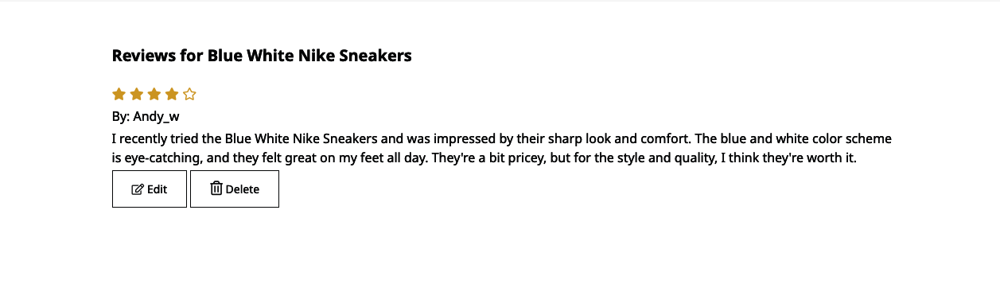
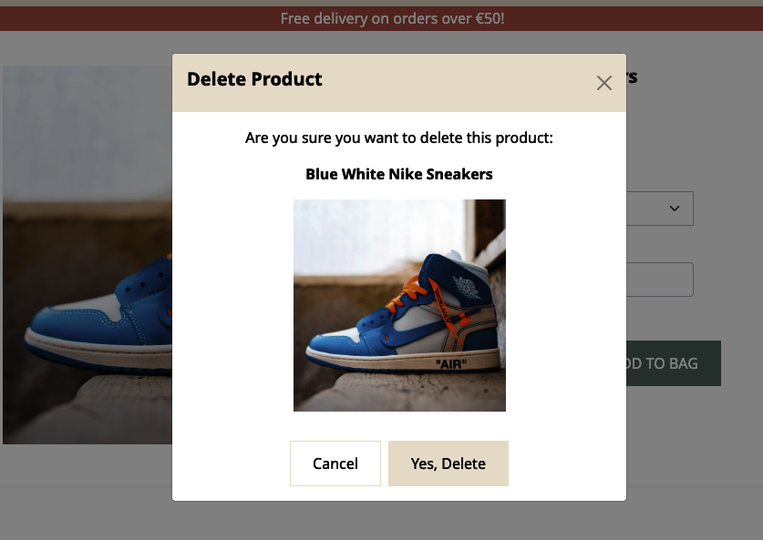

# **Footwear Fusion - Testing**  

[Back to the main README.md file](../Footwear-Fusion-README.md)

[Back to the Testing section in main README.md file](Footwear-Fusion-README.md#testing)

[View the live website here](https://footwear-fusion-9bb895189ceb.herokuapp.com/)  

## **Table of Contents**  
1. [User Stories Testing](#1-user-stories-testing)  
   - [Unregistered Users' Goals](#unregistered-users-goals)  
   - [Registered Users' Goals](#registered-users-goals) 
   - [Administrative Account Holder's Goals](#administrative-account-holder-s-goals) 
2. [Autoprefixer CSS](#autoprefixer-css)
3. [Manual Testing](#3-manual-testing)
   - [Browsers Compatibility](#browsers-compatibility) 
   - [Devices](#devices)
   - [Responsiveness](#responsiveness)
   - [Links](#links)
   - [Forms](#forms)
   - [Defensive Testing](#defensive-testing)
4. [W3C Validator Testing](#4-w3c-validator-testing) 
   - [HTML](#html)
   - [CSS](#css)
5. [JSHint Testing](#5-jshint-testing)
6. [Pep8 Online Testing](#6-pep8-online-testing)  
7. [Lighthouse Testing](#7-lighthouse-testing)  

<br/>

The website underwent thorough testing throughout and after its development phase, utilizing various methods detailed below. This testing was integral to ensuring the website's functionality and reliability.

- **Front-End Testing**: Utilized ```console.log()``` and browser developer tools for real-time debugging and analysis.

- **Back-End Testing**: Implemented variable printing to the terminal to monitor back-end processes and data handling.

- **User Story-Based Manual Testing**: Conducted hands-on testing and refinement in alignment with defined user stories to ensure user-centric functionality.

- **Automated Testing with Django**: Employed Django's automated testing framework towards the end of the development cycle to validate code integrity and application behavior.

- **Additional Testing Methods**: Engaged in various other testing procedures using specific software tools to further ensure the robustness of the website.

Below is the documentation of these testing processes.


### **1. User Stories Testing**  

**A. As a shopper I want to be able to:**

1. *Rapidly discern the type of products or services offered by the site.*

   The company logo is prominently displayed at the top-center of the homepage, effectively highlighting our brand. The company name is clear and descriptive, immediately conveying the nature of our products. Additionally, the hero image prominently features shoes, clearly indicating our primary product line. As users scroll down the homepage, they will encounter intuitive navigation facilitated by large, visually appealing images of our products.
     

2. *Instantly notice any special deals or promotions.*

   As users navigate down the homepage, they will encounter the Final Sale section. Clicking on the 'Shop Now' button will redirect them to a product page where all items on sale are conveniently pre-filtered for easy browsing.
      

3. *Effortlessly search for specific products.*

   Upon visiting the website, users have immediate access to the search function. On desktop, this feature is conveniently positioned at the top left of the screen, while on mobile devices, it is located on the right side.
     

4. *Observe a preview of the most popular products.* 

   On the homepage, visitors can also explore a selection of the website's eight best-selling products. These popular items are showcased in a multi-item carousel format, allowing users to easily browse through them by clicking on the arrows to navigate left or right.
     

5. *Browse through all products and smoothly transition between different categories.*

This website is organized into three primary categories: Women, Men, and Kids. When users select a category, it reveals a list of subcategories within it, such as Boots, Sneakers, Flats, and more. On desktop, a convenient side navigation menu enhances the user experience, enabling seamless transitions between categories and subcategories. On mobile devices, the side navigation transforms into a dropdown menu for user-friendly navigation. Additionally, a Breadcrumb Navigation feature is provided, allowing users to easily navigate back to broader categories for added convenience.

   
  

6. *Organize products by price, rating, or popularity.*

The sorting feature is located in the top-left corner of the products page.

  

7. *Explore detailed information on individual product pages.*

By clicking on the product image, users will be redirected to the Individual Product page, where they can access comprehensive details related to the product.

   

8. *Access reviews for products.*

Users can scroll down on the Individual Product page to discover the product's reviews situated beneath its information.

 

9. *Conveniently choose product size and quantity, and add them to the shopping bag.*

Customers have the convenience of effortlessly choosing their desired size and quantity, followed by a simple click on the "Add To Bag" button to make a purchase.

  

10. *View the contents of the shopping bag.*

When users add a product to their shopping bag, a notification toast will appear in the top-right corner to provide information about the shopping bag's status.

  

Users have the option to access the Shopping Bag page through two methods: either by selecting the "Shopping Bag" option in the Navigation Bar or by clicking the "Go To The Shopping Bag" button located within the toast notification.

 

11. *Modify the shopping bag by changing product quantities or removing items.*

Customers have the convenience of effortlessly modifying the product quantity by simply choosing the desired quantity. As a result, the Subtotal will automatically adjust to reflect this change. In the event that users wish to remove a product from their shopping bag, they can do so by clicking on the Trash icon.

 

12. *Seamlessly proceed to checkout and input payment details.*

13. *Be assured of the security of personal and payment information.*

Upon selecting the 'Secure Checkout' button located on the Shopping Bag page, users will be seamlessly redirected to the Checkout page. Within the payment section, the card payment details are conveniently organized into separate fields for card number, expiration date, CVC, and zip code entry.

  

14. *Receive confirmation of orders post-purchase.*

Once users have completed the checkout form and clicked the 'Complete Order' button, they will be seamlessly redirected to a confirmation page displaying their order details. Simultaneously, they will receive an order confirmation email in their inbox.

  

15. *Get email notifications confirming purchases.*

As previously mentioned, users will receive an email confirmation in their inbox each time they successfully place an order.

  

16. *Engage with informative articles or blogs about shoes and accessories.*

Users have the option to access the Articles page through two pathways: either by clicking the articles link in the footer or by navigating from the homepage. Once on the Articles page, they can select and view an article by simply clicking on their desired choice.

  

  


17. *Navigate the site with ease using the Navigation Bar and Footer.*

The website features a consistent Navigation Bar and Footer across all pages to enhance user navigation. The Navigation Bar is affixed to the top of the screen, ensuring it remains visible as users scroll down, providing convenient access to navigate the entire site.

For desktop users, the Navigation Bar and Footer are displayed as follows:

   

   

On the other hand, for mobile users, the Navigation Bar and Footer are presented as follows:

 

     


18. *Register for an account without hassle.*

To access registration or login options on the website, users can simply click the 'Sign In' link located on the left side of the Navbar when using a desktop computer. On mobile devices, they can achieve the same by tapping the user icon. These actions will lead users to either the Register/Sign Up page or the Log In page, depending on their choice.


   


19. *Locate a FAQ section for inquiries.*

Users can locate the link to access the FAQ page within the website's footer.

 

20. *Contact the store through an accessible contact form.*

Users can also locate the link to access the contact page within the footer section.

   


[Back to top &uarr;](#table-of-contents)  
<br/>

**B. As a registered user/ shopper, I want to be able to:**

1. *Access all functionalities available to non-registered shoppers.*

All functionalities available to unregistered shoppers are also accessible to registered users who are logged in.

2. *Log in and log out with ease.*

Users logged in can easily log out by clicking the user icon located on the left side of the Navbar.

   

3. *Promptly recover forgotten passwords.*

On the Log In page, users have the option to reset their password. Clicking the designated link below the login buttons will redirect them to the password reset page.

 

  

4. *Get email confirmations upon registration.*

Upon successful registration, users are prompted to check their email inbox for a verification message from Footwear Fusion. This email contains a link for verifying their email address. Clicking on this link will redirect them back to the website to confirm their email address.

    

     

       

5. *Manage a personal user profile to view order history and update personal details.*

Users can access their personalized profile by clicking on 'My Account' in the Navbar or the user icon on mobile. The profile page includes tabs for 'My Information', 'My Purchases', and 'Ratings/Reviews', allowing users to update their information, view order history, and manage their reviews.

  
   

6. *Submit reviews for previously purchased products.*

Users can review previously purchased products by navigating to the 'Ratings/Reviews' tab on their profile page and clicking the 'Give Review' button.


  

7. *Modify or delete personal reviews.*

Users can edit or delete their product reviews. To do so, they can navigate to the Individual Product page, where they'll find 'Edit' and 'Delete' buttons under their review. Editing a review takes them to a page with pre-populated review content, while deleting a review prompts a confirmation modal.

  

 

  

8. *Place products in a wishlist for convenient access to items I'm interested in buying.*

Users can add products to their wishlist by clicking the heart icon on each product, which turns red to indicate the item is in their favorites.

 

9. *Remove products from the wishlist, so I can remove products I don't wish to purchase.*

10. *Transfer products from the wishlist to the shopping bag effortlessly.*

Accessing the 'Favorites' page via the Navbar (heart icon on mobile), users can view all items in their wishlist. Products can be removed by clicking the Trash-can icon or added to the shopping bag by selecting a size and clicking the 'Add to Bag' button.

    

**C. As an admin and store management, I want to be able to:**

1. *Add new products to the inventory.*

I can add a new product to the website by logging in with admin credentials, navigating to 'My Account', and selecting 'Product Management'. This leads me to the 'Add Products' page, where I fill out the product details and submit it using the 'Add Product' button.

   

2. *Modify or update product details.*

To edit a product, I log in as admin, go to either the 'Products' page or an 'Individual Product' page, and click the 'Edit' link. This action redirects me to the 'Edit Products' page, where I can update the product information and confirm the changes by clicking the 'Edit Product' button.

   

   

3. *Remove products from the listing.*

For product deletion, I log in as admin, navigate to the 'Products' page or the 'Individual Product' page, and click the 'Delete' link. A confirmation modal appears, and I can complete the deletion process by clicking the 'Yes, Delete' button.

   


### **2. Auto Prefixer CSS**   
[Autoprefixer CSS](https://autoprefixer.github.io/) was used to add CSS vendor prefixes to the CSS rules after the developing process was done, to ensure that the they work across all browsers.  

<br/>  

### **3. Manual Testing by The Developer**  
#### **Browsers Compatibility**   
The website underwent testing across various browsers, including Google Chrome, Microsoft Edge, Opera, Mozilla Firefox, and Safari (iOS).

#### **Devices**  
The site was viewed and assessed on multiple devices, such as:
- Macbook Air 2017 13 inch screen.
- Mobile: iPhone 14 Pro, iPhone XR, iPhone 12 Pro.
- Friends and family members were asked to review the site on their devices and to point out any bugs and/or user experience issues.  

#### **Responsiveness**   
Throughout development, the website's responsiveness on different devices was regularly tested using developer tools.

**Result**: 

#### **Links**   
All website links and buttons were rigorously tested to ensure:
- Correct and expected functioning of all navigation links.
- Social media buttons open in a new tab and function correctly.

**Result**: Confirmed all links and buttons are functioning correctly.

#### **Form Validation and Functionality**  
Website forms were tested for:
- Automatic data pre-population in forms like Edit Review, Edit Product, Checkout, and User Profile Information (when data exists).
- Proper functioning of required attributes.
- Display of validation messages for incorrect format in username and password fields.
- Correct operation of Submit, Cancel, and Back buttons.
- Data saving into the database.
- Display of a toast message for feedback after form submission.

**Result**: All forms are functioning as intended.

  


#### **Defensive (Security) Testing**  
Defensive testing was conducted to ensure certain actions are restricted to authorized users/admins. This included tests such as: