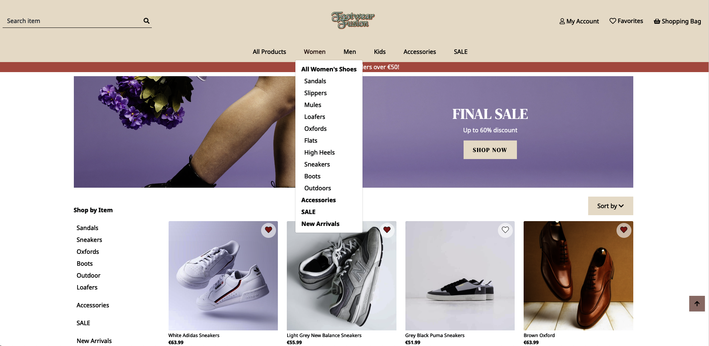
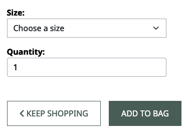
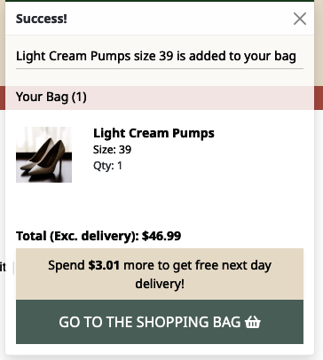

# **Footwear Fusion - Testing**  

[Back to the main README.md file]()  

[Back to the Testing section in main README.md file]()

[View the live website here]()  

## **Table of Contents**  
1. User Stories Testing  
   - Unregistered Users' Goals  
   - Registered Users' Goals  
   - Administrative Account Holder's Goals  
2. Autoprefixer CSS  
3. Manual Testing  
   - Browsers Compatibility  
   - Devices  
   - Responsiveness  
   - Links  
   - Forms  
   - Defensive Testing  
4. W3C Validator Testing  
   - HTML  
   - CSS  
5. JSHint Testing  
6. Pep8 Online Testing  
7. Lighthouse Testing  

The website was extensively tested during the development by using:
- console.log() and developer tools for front-end  
- printing variables to the terminal for back-end  
- manual testing and developing based on the user stories  

### **1. User Stories Testing**  

As a shopper I want to be able to:

1. *Rapidly discern the type of products or services offered by the site.*

   The company logo is prominently displayed at the top-center of the homepage, effectively highlighting our brand. The company name is clear and descriptive, immediately conveying the nature of our products. Additionally, the hero image prominently features shoes, clearly indicating our primary product line. As users scroll down the homepage, they will encounter intuitive navigation facilitated by large, visually appealing images of our products.
     

2. *Instantly notice any special deals or promotions.*

   As users navigate down the homepage, they will encounter the Final Sale section. Clicking on the 'Shop Now' button will redirect them to a product page where all items on sale are conveniently pre-filtered for easy browsing.
      

3. *Effortlessly search for specific products.*

   Upon visiting the website, users have immediate access to the search function. On desktop, this feature is conveniently positioned at the top left of the screen, while on mobile devices, it is located on the right side.
     

4. *Observe a preview of the most popular products.* 

   On the homepage, visitors can also explore a selection of the website's eight best-selling products. These popular items are showcased in a multi-item carousel format, allowing users to easily browse through them by clicking on the arrows to navigate left or right.
     

5. *Browse through all products and smoothly transition between different categories.*

This website features three primary categories: Women, Men, and Kids. Upon selecting a category, users are presented with all relevant subcategories such as Boots, Sneakers, Flats, etc. For desktop users, a side navigation bar enhances the browsing experience, allowing for seamless transitions between categories and subcategories. In the mobile version, this side navigation is conveniently replaced by a dropdown menu for optimal usability. Additionally, Breadcrumb Navigation is implemented across the platform, enabling users to easily backtrack to broader categories.

   
  

6. *Organize products by price, rating, or popularity.*

The sorting feature is located at the top-left corner of the products page.

  

7. *Explore detailed information on individual product pages.*

Users have the option to click on a product image, which will redirect them to the Individual Product page. Here, they can access all pertinent information related to the product.

   

8. *Access reviews for products.*

On the Individual Product page, users have the ability to scroll beneath the product information to find customer reviews.

 

9. *Conveniently choose product size and quantity, and add them to the shopping bag.*

To purchase an item, users can conveniently choose the desired size and number of units. After making their selections, they simply click the Add To Bag button to complete the transaction.

  

10. *View the contents of the shopping bag.*

When an item is added to the shopping cart, a brief notification will automatically appear in the upper right corner of the screen. This message alerts the user that the product has been successfully included in their order.

  

Users can access their shopping cart in two ways. They can click the "Shopping Bag" link in the top navigation bar at any time. Additionally, after an item is added, a confirmation popup appears with a "Go To Shopping Bag" button that will directly take them to the cart page.

 

11. *Modify the shopping bag by changing product quantities or removing items.*

From their shopping cart, users can seamlessly edit the amount they wish to purchase by choosing a new quantity in the dropdown menu. The subtotal will automatically update to reflect these changes. Additionally, if a customer decides to remove an item from their order, they simply click the trash icon next to that product to eliminate it from their cart.

 

12. *Seamlessly proceed to checkout and input payment details.*

13. *Be assured of the security of personal and payment information.*

Users can finalize their purchases by selecting the "Secure Checkout" button on the shopping cart page. This will direct them to the checkout screen. The payment fields are conveniently split into sections for the card number, expiration date, CVC security code, and billing zip code to streamline the payment process.

  

14. *Receive confirmation of orders post-purchase.*

Once users complete the checkout form and select the "Complete Order" button, they will be taken to an order confirmation page summarizing their purchase details. Simultaneously, they will receive an email confirmation containing their order information in their inbox for their records.

  

15. *Get email notifications confirming purchases.*

16. *Engage with informative articles or blogs about shoes and accessories.*

17. *Navigate the site with ease using the Navigation Bar and Footer.*

18. *Register for an account without hassle.*

19. *Locate a FAQ section for inquiries.*

20. *Contact the store through an accessible contact form.*